necessário# README
Projeto desenvolvido para fins de estudo.
# Minha Social

Minha pequena rede social.
Tudo começou pequeno com uma simples vontade de estudar....
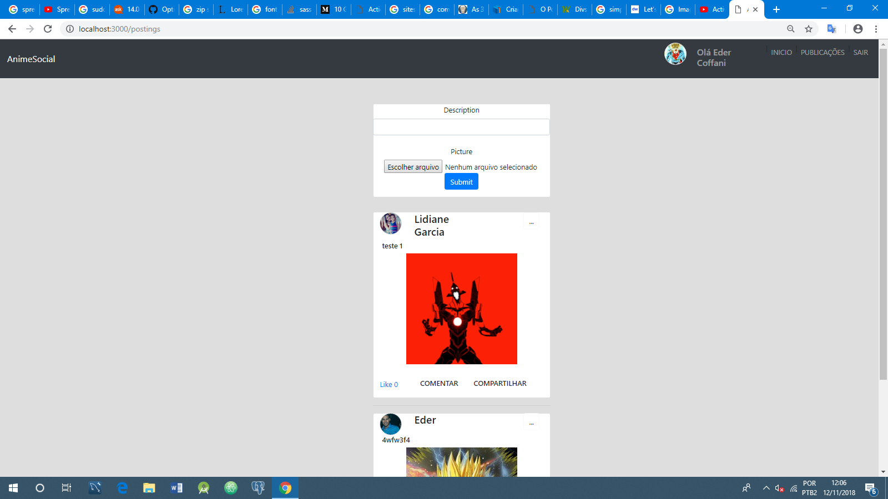

Logo dei uma melhorada....
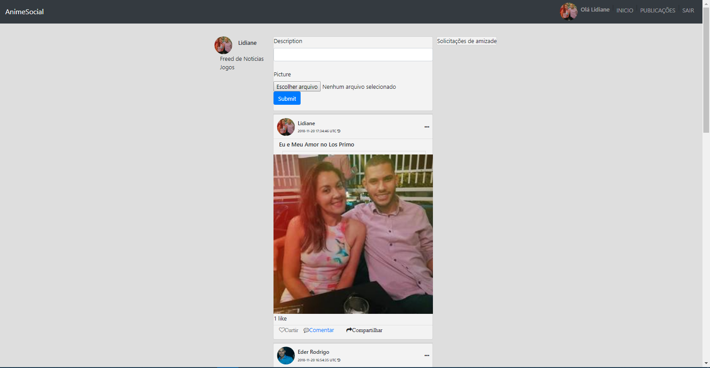

Depois fui adicionando mais telas e funcionalidades....
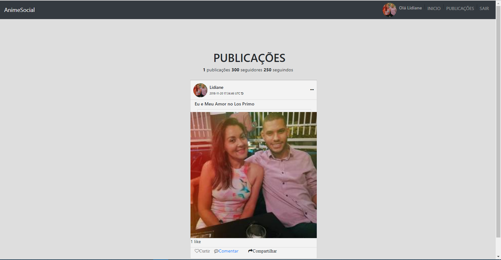

E modificando designer....
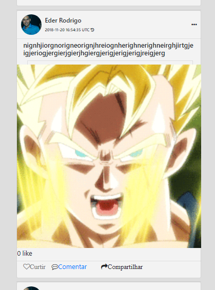
Com curiosidade de saber como se monta um sistema de rede social, fui em busca de
conhecimento, a partir disso consegui montar do zero uma pequena parte do que um dia será uma rede social.

Adicionando a parte de comentários as postagens

1 - Criei uma model com referencia ao comentário e usuário assim

Ao criar o model de comentário temos que colocar uma a referencia de onde os comentários estão para ir, ou seja ao colocar "belongs_to :posting" só ira para esta classe se conter sua chave estrangera que no caso é "has_meny :comments", que será referenciado por "posting e user".

Imagem dos model depois de criar o model "Comment" com "referencia a posting e user".

Model Comment.
  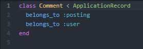

Model Posting.
  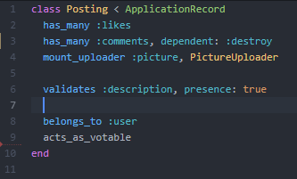

Model User.
  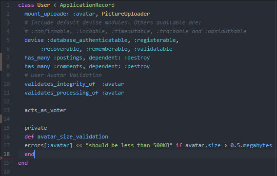

Logo é gerado uma migração com referencia a posting e user ou (Foreign_key-Chave Estrangera).
  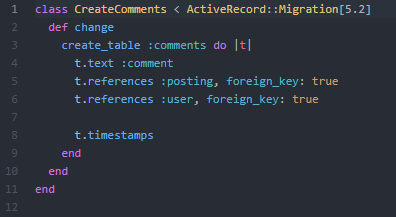

Como podemos perceber o Rails gera Automaticamente as extrusões de banco de dados para que o desenvolvedor tenha mais produtividade.
  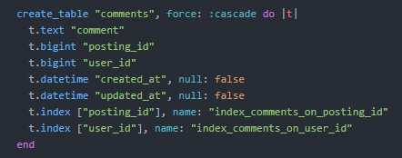

Depois dessa etapa precisamos programar a alteração no comments_controller e nas view comment e na de posting

No controller fazemos a associação de comentários aos posts e usuários, então no "create" fazemos a magica, primeiro criamos uma variável de instancia no "create" buscando os "posting pelo id e associamos ele ao comment", na "tabela comment" contem a "Foreign_key do post e usuário" então nesta logica devemos buscar os comment referente ao post e user, para que criar o comentario(comment) primeiro temos fazer o usuário(user) ser o user "current_user.id" e depois verificar se possui usuário logado para criar o comentário se sim o sistema renderizar para pagina de postings se não retorna para novo comentário.

  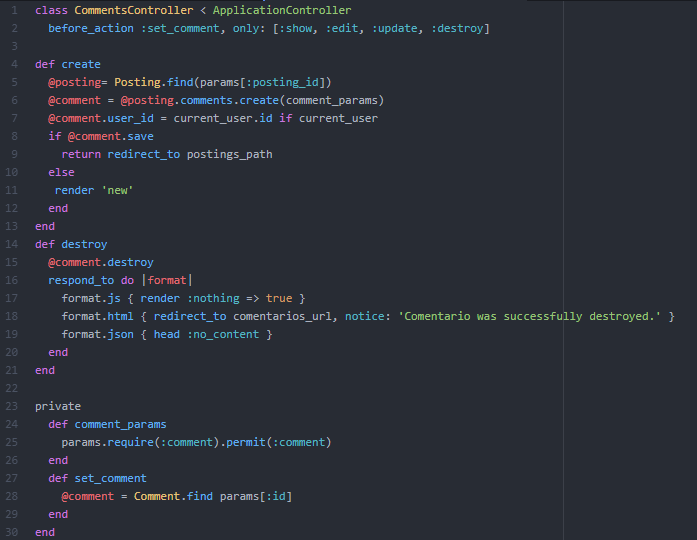

Nesta mesma logica fazemos para Destruir os comentários(comment), no "destroy" criamos uma variável de instancia e colocamos o método destroy para destruir o comentário, no Rails tem uma magica que passa os "parâmetros(params)" sem a necessidade de poluição de código depois do private criando o método set_comment e ativar ele no topo como "before_action :set_comment ..." assim simplificado os métodos.

Em seguida é só "criar na view comments o layout necessário para a chamada do formulário de envio de comentário e recebimento", crie um view "parcial chamada de "form.html.erb e outra como como comment.html.erb" usando o " _ para usamos como partes em outros layouts e deve ficar assim.

  Formulário de comentário
  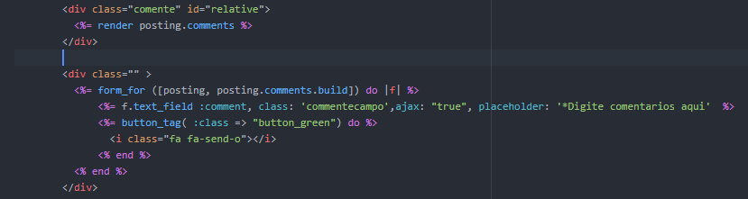

  Recebendo os comentários
  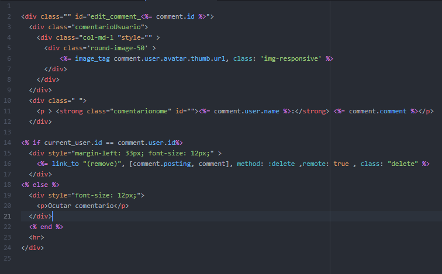

  Então para finalizar criemos uma view Em Js para renderizar somente a parte de remover os comentários ficando assim.
  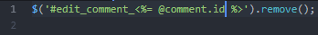

  Então para que funcione temos que colocar "remote: true" na parcial comments/_ comment.html.erb em destroy(remove) e depois alterar no comments_controller a forma de retorno para format.js e então dentro da view destroy.js.erb criar um id e vincular ele com o id do comment e remover ele instantaneamente.... assim dando o carregamento assíncrono sem a espera de redirecionar.

  ao finalizar o resultado será assim  
  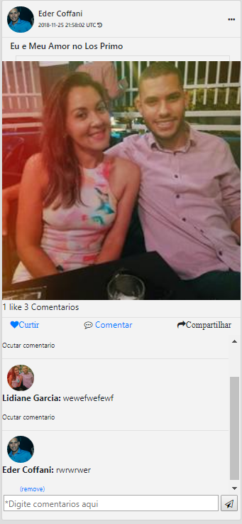

A Social consiste nas gems devise para login inteligente, carrierwave para carregamento e upload, mini_magick para manipular os processamento dos tamanhos das imagens, acts_as_votable para facilitar a entrada da avaliação e votação nos posts de cada usuário e muito mais, foi implementado também o bootstrap para o designer do webapp, o aplicativo ainda esta em faze de desenvolvimento como a parte de adicionar amigos, compartilhar publicação, chat e outras funcionalidades.

Experiência?
Não como um desenvolvedor profissional, mas sim como um cara que lutou pelo seu objetivo e fez, encontrar esta linguagem de programação
tornou tudo tão divertido interessante, pois é muito interativa pelo experiência de uso. Espero que com estes esforços possa um dia
mostrar um talento diferente com uma visão simples mas que faça com que algo complexo se resolva facilmente.  

* Configuration
* Ruby version

ruby 2.5.1p57 (2018-03-29 revision 63029) [x86_64-linux]

Rails 5.2.1 (Framework)

Bundle install

* Database creation

PostgreSQL
